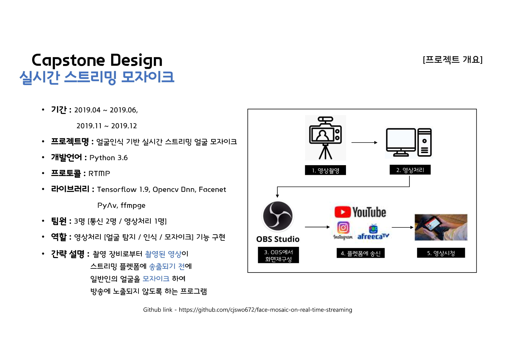
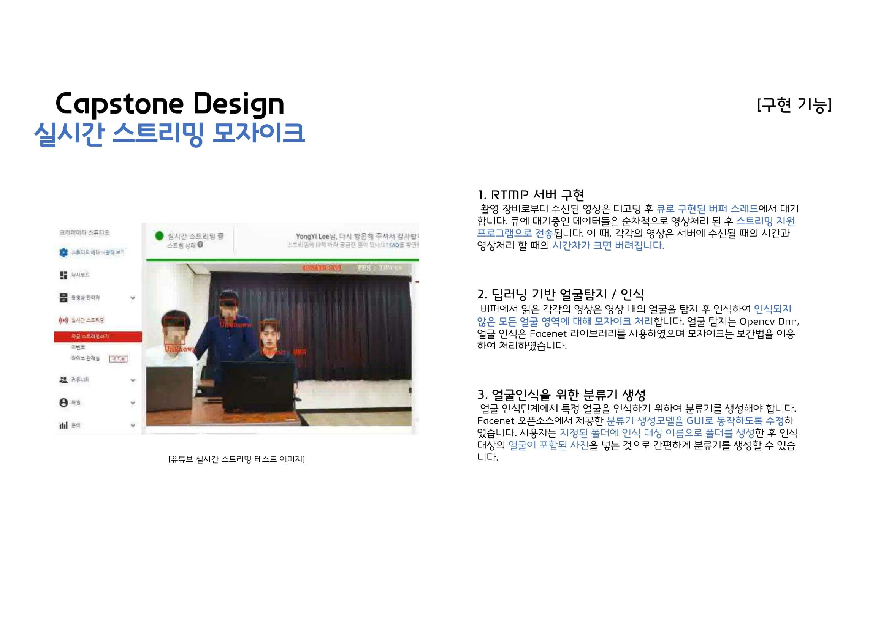

## How to Run
1. download '[det1.npy, det2.npy, det3.npy and 20180402-114759]' from (https://github.com/davidsandberg/facenet)

2. add above files into 'model' directory

3. add your images that you want to recognize into 'dataset' directory

4. run alignment.py and classifier.py

5. run main.py

## Document

